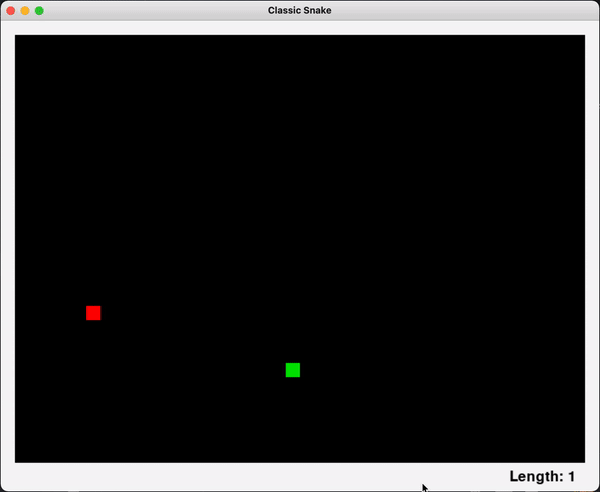

# Snake Game with Pygame
This repository is for the purpose of sharing my progress as I create Snake with Pygame.

    

## How to Play!

> * Use `W`,`A`,`S`,`D` or `ARROW KEYS` to move the snake around

## Files
A list of files that are contained in this repository

> * `images/snake_logo.png`
> * `images/snakegif.gif`
> * `snake.py`
> * `snakegame.py`
> * `README.md`
> * `LICENSE (MIT)`

## Dependancies
These are required for the game to run on the terminal **(executable coming soon)**

> * `Python 3.7.7 or greater`
> * `Pygame`
>     - To install Pygame, run this command: `python3 -m pip install -U pygame --user`

## How to Run
A set of instructions for running the game from the terminal

> 1. Clone the repository
> 2. Within the repository, run `python3 snakegame.py`
> 3. To exit, just close the game window
>
> **No code to compile, Python is an interpreted language**

I have completed this project. With the exception of any improvements I make to the code in the future, every pending feature is implemented. Thank you for sticking around for the ride or for checking this out for the first time! :)
